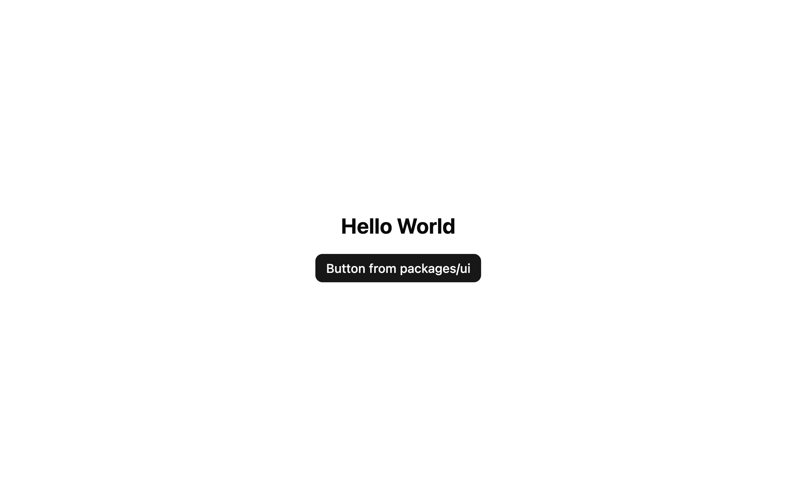

# 🎨 shadcn/ui Vite Monorepo Template

<div align="center">
  
</div>

This template exists because the [official shadcn/ui monorepo](https://ui.shadcn.com/docs/monorepo) is built around a **Next.js** setup. While powerful, Next.js is primarily server-rendered, and sometimes you just want a **lightweight, client-only solution**—especially for static or cost-sensitive apps.

This template offers a **Vite + React + shadcn/ui** monorepo alternative. It lets you:

- Use **shadcn/ui** component architecture and styling conventions.
- Stick with **client-side rendering** (no SSR or backend infra).
- **Save costs** by deploying to static hosting providers (e.g., Vercel static, Netlify, Cloudflare Pages).
- Enjoy faster local dev and simpler deployments.

## 🚀 Quick Start

### Prerequisites

- Node.js (`>=20`)
- pnpm (version defined in `packageManager` field)

```bash
# Clone the repository
git clone https://github.com/your-username/shadcn-vite-react-typescript-monorepo.git my-app

# Navigate to the project directory
cd my-app

# Install dependencies
pnpm install

# Start development server
pnpm dev
```

## 🗂 Folder Structure

```
├── apps/
│   └── web/                # Vite + React app
│       ├── public/
│       ├── src/
│       ├── components.json # shadcn/ui config
│       └── vite.config.ts
├── packages/
│   ├── ui/                 # Shared shadcn/ui components
│   │   ├── components/     # UI components
│   │   ├── lib/            # Utilities (e.g., cn)
│   │   ├── styles/         # Global styles (globals.css)
│   │   └── components.json
│   ├── eslint-config/      # Shared ESLint config
│   └── typescript-config/  # Shared TypeScript config
├── pnpm-workspace.yaml     # Monorepo workspace config
├── turbo.json              # Turborepo pipeline config
└── package.json            # Root config
```

## 🚀 Features

- **Monorepo**: Managed with pnpm workspaces and Turborepo.
- **Web App** (`apps/web`): Vite + React + TypeScript, styled with Tailwind CSS.
- **UI Package** (`packages/ui`): Shared components, styles, and utils.
- **Centralized Configs**: Shared ESLint and TypeScript setups.
- **shadcn/ui Integration**: Easily share and reuse components across the monorepo.

## ➕ Adding shadcn/ui Components

You can add components using either of the following methods:

### Option 1: From the Monorepo Root

```bash
pnpm dlx shadcn@latest add <component> -c apps/web
```

Example:

```bash
pnpm dlx shadcn@latest add button -c apps/web
```

### Option 2: From Inside the App Directory (Follow [Official Guide](https://ui.shadcn.com/docs/monorepo))

```bash
cd apps/web
npx shadcn@latest add <component>
```

Example:

```bash
cd apps/web
npx shadcn@latest add button
```

This:

- Uses `apps/web/components.json` for config.
- Adds components to `packages/ui/src/components`.
- Updates `packages/ui/package.json` with required deps.

Aliases like `"ui"` and `"utils"` in `components.json` ensure shared usage via `@workspace/ui`.

## 🧱 Using Components in `apps/web`

```tsx
import { Button } from "@workspace/ui/components/button";

function App() {
  return <Button>Click Me</Button>;
}
```

## 📦 Build

Build all packages:

```bash
pnpm build
```

Runs `build` scripts via Turborepo, including Vite build for the web app.

## ✅ Linting

Run lint across all packages:

```bash
pnpm lint
```

Uses the `lint` scripts in each package (e.g., `apps/web`, `packages/ui`).

## 🛠 Customization Checklist

- **Project Info**:

  - [ ] Update `name` and `description` in all `package.json` files.
  - [ ] Edit browser tab title (`apps/web/index.html`).
  - [ ] Replace logos/favicons (`apps/web/public/`).

- **Styling**:

  - [ ] Define brand colors (`packages/ui/tailwind.config.mjs`).
  - [ ] Customize global styles (`globals.css`).
  - [ ] Extend or adapt UI components.

- **Docs**:

  - [ ] Update this `README.md`.
  - [ ] Add contributing guidelines (if needed).
  - [ ] Document architecture or decisions.

- **Cleanup**:

  - [ ] Remove unused example code/components (e.g., `App.tsx`).

  ## 📸 Screenshot

<div align="center">
  
</div>

## 📄 License

MIT
